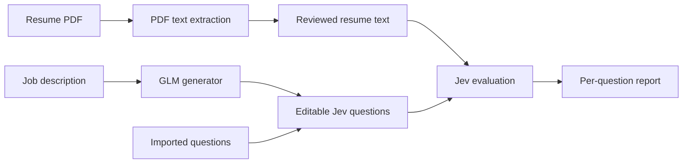

# Jev Screening Workspace

An AI-assisted workspace for reviewing a resume against a job's requirements.
Upload a PDF, turn a job description into editable screening questions, and review
structured answers with visible probabilities and confidence.

Built with **React, TypeScript, FastAPI, GLM-5.3-Flash, and Jev**, it separates
requirement generation from resume evaluation. The interface takes inspiration
from VS Code: resume and question editors on the left, a readable report on the
right, and dark and light themes.

## What it can do

| Capability | How it works |
| --- | --- |
| Read a resume | Upload a text-based PDF or paste text. Review and edit the extracted content. |
| Generate requirements | Paste a job description. GLM-5.3-Flash generates questions through OpenRouter. |
| Bring your own questions | Paste and edit a Jev question dictionary, with Choice, Noul (yes/no), or Score questions. |
| Validate criteria | Check imported or edited role criteria through a dedicated API endpoint, without a model call. |
| Screen a resume | Send the resume and reviewed questions to Jev through OpenRouter. |
| Understand the result | See each question's most likely outcome, its probability, and model confidence separately. Expand a result for alternative probabilities. |
| Keep review in context | Edit inputs to invalidate stale results, switch themes, cancel waiting for a request, or clear the session. |

Generated role questions use four outcomes: **meets**, **partial**,
**does not meet**, and **insufficient evidence**. The prompt distinguishes an
explicit shortfall from information that simply is not present in the resume.
The interface preserves ties and missing confidence values instead of inventing
certainty. It does not combine results into an overall hiring score.

## The workflow

1. **Add a resume.** Upload a text-based PDF or paste the resume into the editor.
2. **Define the questions.** Paste a question dictionary, or generate one from a
   job description. Review and edit the requirements before continuing.
3. **Run screening.** Jev evaluates the resume against those questions.
4. **Review the evidence.** Inspect the most likely answer to each question,
   alternative probabilities, and the model's confidence.



The generator creates the questions; Jev answers them. Both integrations use
OpenRouter, with separate model settings. The generation prompt is available in
[the criteria domain](apps/api/domains/criteria/prompt.py) and through
`GET /api/criteria/prompt`.

## Run locally

### Prerequisites

- Python **3.12+**; the project is tested locally with Conda and Python 3.13.
- Node.js **22.18+** and npm.
- An OpenRouter API key and available credits for generation and screening.
- macOS or Linux for the root launcher.

### First-time setup

From the repository root, create or activate a Python environment. If you already
have `resume-screening-project`, skip the creation command:

```sh
conda create -n resume-screening-project python=3.13
conda activate resume-screening-project
python -m pip install -r apps/api/requirements.txt
npm --prefix apps/web ci
cp apps/api/.env.example apps/api/.env
```

Edit `apps/api/.env` and set `OPENROUTER_API_KEY`. Keep that file private; it is
ignored by Git. Provider credentials belong in the backend, never in the frontend.

### Start both servers

With the Python environment activated, run:

```sh
./run.sh
```

- **Workspace:** http://127.0.0.1:5173
- **API documentation:** http://127.0.0.1:8000/docs
- **Health check:** http://127.0.0.1:8000/api/health

The launcher uses your active Python interpreter, starts both development servers,
and stops both when you press **Ctrl+C**. If either server exits, it stops the
other. It reports occupied ports rather than terminating an existing process.
It does not install dependencies automatically.

You can also select an interpreter explicitly:

```sh
PYTHON_BIN=/path/to/environment/bin/python ./run.sh
```

Vite proxies `/api` to FastAPI on port 8000. No local CORS configuration is needed.
For separate startup or a custom API address, see the
[frontend guide](apps/web/README.md) and [backend guide](apps/api/README.md).

### Configuration

| Variable | Purpose |
| --- | --- |
| `OPENROUTER_API_KEY` | Backend credential for generation and screening. |
| `GENERATOR_MODEL` | Generation model; defaults to `z-ai/glm-5.3-flash`. |
| `JEV_MODEL` | Decision model; defaults to `~typesafe/jev-latest`. |
| `PROVIDER_TIMEOUT_SECONDS` | HTTP timeout. The example environment sets 60 seconds; the code default is 25. |
| `LOG_LEVEL` | Console verbosity, default `INFO`. |

## Architecture

```text
run.sh                   Start the API and frontend together
scripts/dev.py           Development server process management
apps/
  api/
    api/                 FastAPI application, router registration, middleware
    config/              Environment and logging configuration
    core/                Shared response and logging infrastructure
    domains/
      documents/         PDF extraction
      criteria/          Question generation and validation
      screening/         Resume evaluation
      health/            Health endpoint
    integrations/        PDF reader, generator, and Jev clients
    utility/             Shared helper package
    tests/               Backend tests with mocked provider calls
  web/
    src/                 React workspace, API client, result interpretation
```

The backend uses a feature-oriented structure. Each domain owns its factory,
model, repository, router, schema, and service modules. Repository modules are
placeholders: there is no application database or document persistence.
Pydantic validates incoming requests and external responses at the boundaries.

The frontend uses React, TypeScript, Vite, and Zod. Console logs record component
names, request IDs, timings, and errors while excluding document text, prompts,
credentials, and provider response bodies.

## API at a glance

| Endpoint | Purpose |
| --- | --- |
| `GET /api/health` | Service health. |
| `POST /api/documents/parse` | Multipart PDF upload; returns extracted text. |
| `POST /api/criteria/generate` | Job description to Jev question dictionary. |
| `POST /api/criteria/validate` | Validate imported or edited role questions. |
| `GET /api/criteria/prompt` | Read the generation system prompt. |
| `POST /api/screen` | Resume text and question dictionary to Jev answers. |

Data endpoints use a shared `StandardResponse` envelope with `success` and `data`.
The screening endpoint accepts questions directly as an object, without JSON
encoding inside a string. See `/docs` for request and response schemas.

## Scope and limitations

- **Human review, not automated selection.** Outputs describe a model's assessment
  of resume content. They are not verified facts, calibrated hiring probabilities,
  or a recommendation to hire or reject someone.
- **Text-based PDFs only.** There is no OCR. A scanned PDF may return no text;
  pasted text is supported as an alternative.
- **Single-resume workflow.** No batch ranking, ATS integration, accounts, saved
  history, or background job queue is implemented.
- **Explicit limits.** The UI accepts PDFs up to 4 MB. Resume text is limited to
  60,000 characters; job descriptions to 30,000. Generation produces up to 20
  role questions, and screening accepts up to 25 questions.
- **Structural validation.** Criteria validation checks the question contract.
  It does not establish that requirements faithfully reflect the job description.
- **No evidence citations.** Results do not yet locate supporting resume passages
  or generate a verified narrative explanation.
- **External processing.** Job descriptions go to the generation provider;
  resume text and questions go to Jev through OpenRouter. Provider retention
  policies apply. The application does not promise zero retention by third parties.
- **Session-only application state.** Refreshing or clearing the workspace removes
  browser-held inputs and results. Only the theme preference is saved locally.
  Multipart uploads may be temporarily spooled by the API framework.
- **Local development prototype.** Authentication, abuse controls, and production
  deployment configuration are not included. A production frontend needs an
  `/api` reverse proxy; Vite's development proxy is not part of the static build.

## Checks

From the repository root, with the Python environment activated:

```sh
(cd apps/api && python -m unittest discover -s tests -v)
npm --prefix apps/web test
npm --prefix apps/web run build
```

Backend provider calls are mocked in tests; the frontend tests cover question
parsing and outcome interpretation. These checks do not make paid model requests.

## Short project description

> Jev Screening Workspace is an AI-assisted resume review tool with an
> editor-style interface. It uses GLM-5.3-Flash to turn job descriptions into
> editable questions and Jev to evaluate resume evidence against them. A React
> frontend and feature-oriented FastAPI backend make the process inspectable:
> reviewers can edit inputs, inspect individual outcomes, and distinguish model
> confidence from answer probability.
